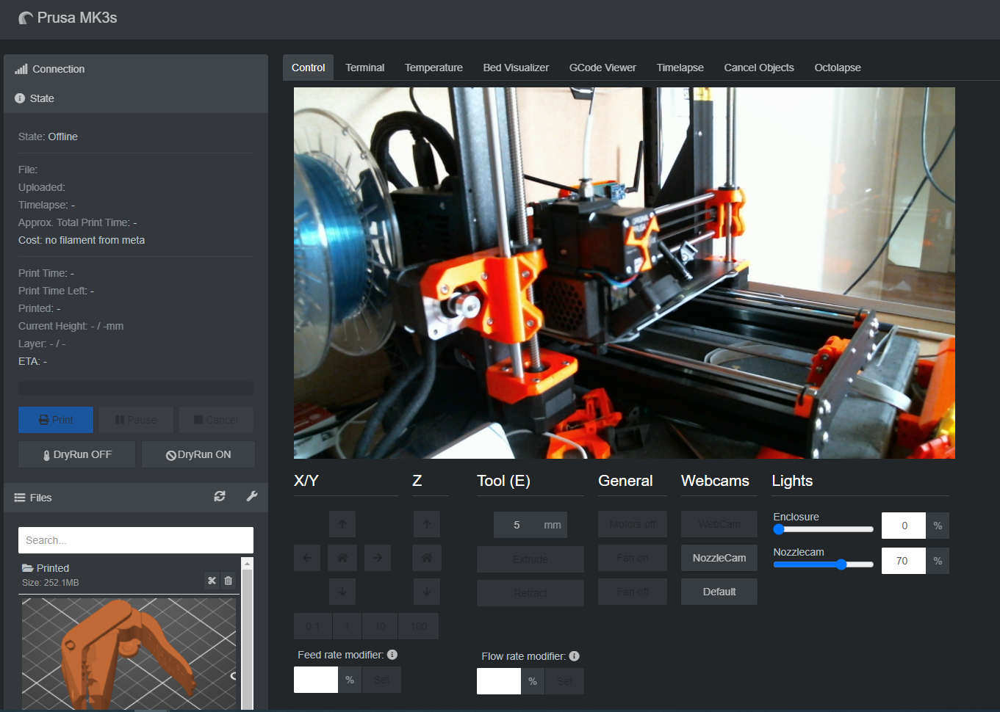
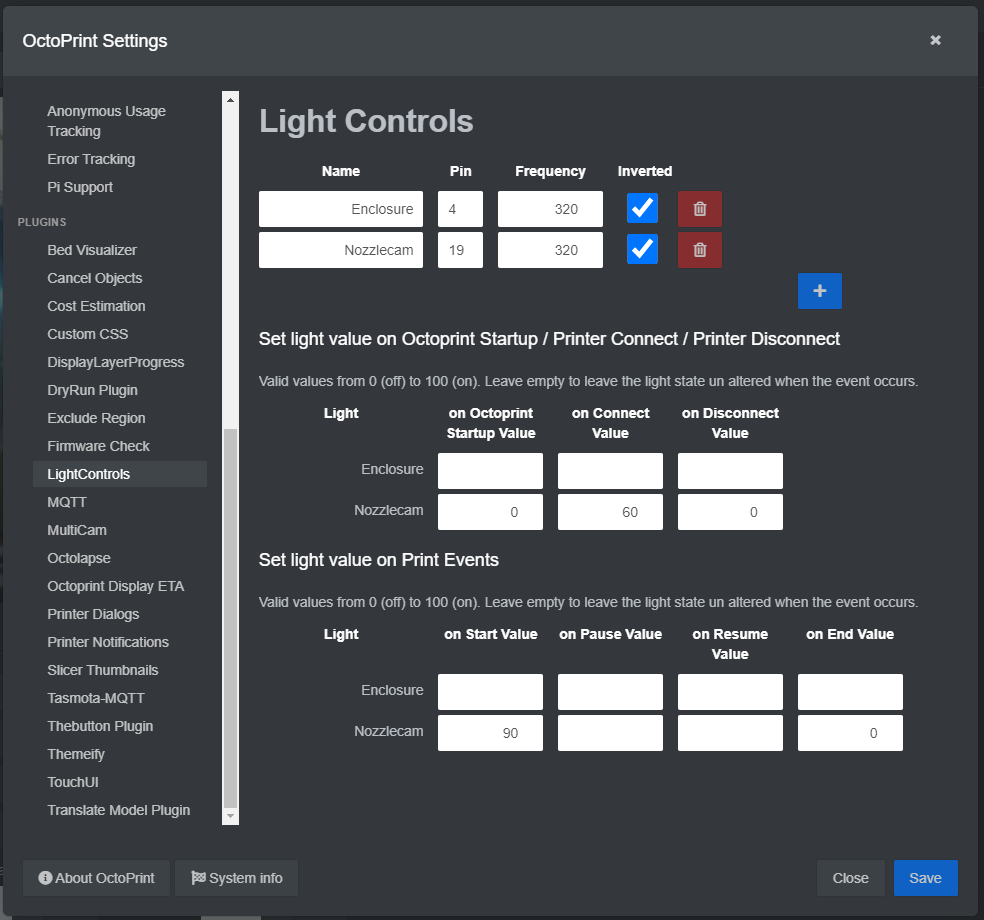

# OctoPrint-LightControls

This plugin allows the user to easilly configure and control a PWM light for Raspberry PI GPIOs. 
The Light controls will show up on the controls tab as shown in the screenshots below.
Additionally, the user can configure light values per light control entity for various Octoprint events such as printer connect / disconnect, print start / end, ...

## Screenshots




## Setup

Install via the bundled [Plugin Manager](https://docs.octoprint.org/en/master/bundledplugins/pluginmanager.html)
or manually using this URL:

    https://github.com/RoboMagus/OctoPrint-LightControls/archive/main.zip

## ⚠️ Use at your own risk
The end user is responsible for setting up the gpio configuration used in this plugin and the corresponding wiring correctly. Failure to do so could damage your Raspberry Pi!
I cannot be held accountable for any damages.

## Configuration

Many PWM controlled Lights can be added through the plugins settings menu.
In the top section you can add the light and give it a name, select the pin to use, etc.
Enabling and Disabling the lights automatically on e.g. print start / stop can be configured in the section below. Here you can enter the light value as a percentage of full brightness. Empty fields imply the light will remain untouched when the event occurs.

## Helpers

As per version `0.3.0` this plugin supports a few helper functions that can be used by other plugin developers to interact with LightControls.
These helper functions are: 
- `get_light_names()`: returns an array of strings containing all configured light names.
- `get_light_value(light_name)`: returns an integer light value as a percentage of brightness (0 to 100) for the provided `light_name` if the entity exists. Returns `None` otherwise.
- `set_light_value(light_name, light_value)`: sets the `light_value` (from 0 to 100) for provided `light_name` and returns the set value if succesfull. Returns `None` otherwise.

An example of how to use these helpers:
```python

helpers = self._plugin_manager.get_helpers("LightControls")
if helpers:
    if "get_light_names" in helpers:
        light_names = helpers["get_light_names"]()
        self._logger.info(f"Light names: {light_names}")
        if "get_light_value" in helpers:
            self._logger.info("Light values before reset:")
            for name in light_names:
                self._logger.info("Light '{}' value: {}".format(name, helpers["get_light_value"](name)))
        if "set_light_value" in helpers:
            set_light_value = helpers["set_light_value"]
            self._logger.info("Light values after reset:")
            for name in light_names:
                value = set_light_value(name, 0)
                self._logger.info(f"Light '{name}' value: {value}")

```